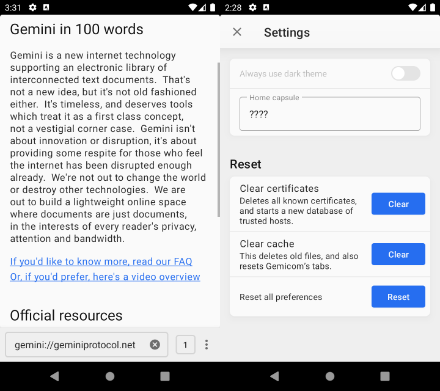

# Gemicom

Gemicom is a new Gemini client for Android. That is, the Geminispace.

I wrote it during my visit to KotlinConf 2025 in Copenhagen on a self-inflicted hackathon. I hope it provides use for those longing for a quieter web.



## Features

* (Very basic) tabs
* Inline images

However, not every status code is handlet yet. **TLS client certificates are not supported yet.**

There are also some restrictions which cannot be configured currently:

* Maximum response header line: 1000 Bytes
* Maximum response size: 10 MiB
* Request timeout: 60s

## Development

```
Gemicom
├───android  ; Android app
├───docs     ; Stuff for this README/upcoming website
├───jniLibs  ; Location for SQLite *.so for Gemicom, see README inside
└───parser   ; Bison/flex grammar for Gemini parser
```

Gemicom is built on a low-level Bison/Flex parser. This parser is wrapped in a "Gemicom library" (libgemicom.so for Android), and then called from the Android app.

You need to run Bison/Flex once (see `Gemicom/parser/Makefile`) to build the parser. `make gemtext` creates a small command-line parser (just for testing), and `make jniLib` creates a JNI library which is required to run Gemicom's tests. However, for compiling the app itself, Android Studio/IntelliJ take care of building the JNI library.

Another required dependency is SQLite. Gemicom does not use Android's built-in SQLite library, but [Xerial's driver](https://github.com/xerial/sqlite-jdbc) with an up-to-date SQLite implementation. You need to download these `.so` files, and put them into `Gemicom/jniLibs/`, see the README inside.

You need to enable Android's NDK/CMake in Android Studio/IntelliJ.

## License

The source code is published under the zlib license (see `LICENSE` file in this repository).

```
Copyright (C) 2025 Eroica

This software is provided 'as-is', without any express or implied
warranty. In no event will the authors be held liable for any damages
arising from the use of this software.

Permission is granted to anyone to use this software for any purpose,
including commercial applications, and to alter it and redistribute it
freely, subject to the following restrictions:

1. The origin of this software must not be misrepresented; you must not
   claim that you wrote the original software. If you use this software
   in a product, an acknowledgment in the product documentation would be
   appreciated but is not required.
2. Altered source versions must be plainly marked as such, and must not be
   misrepresented as being the original software.
3. This notice may not be removed or altered from any source distribution.
```
